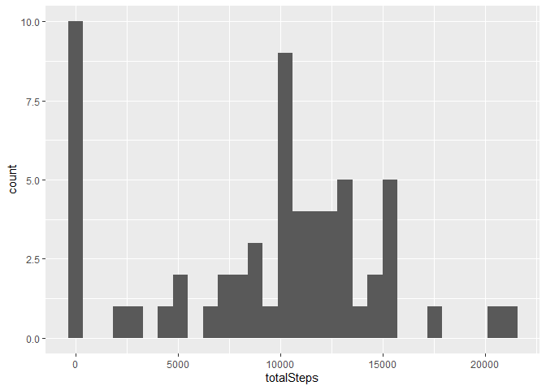
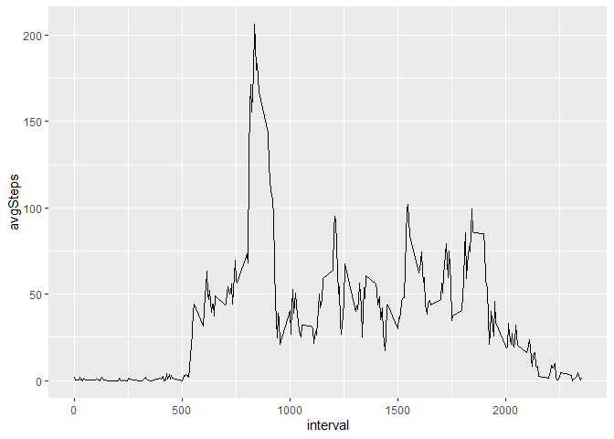
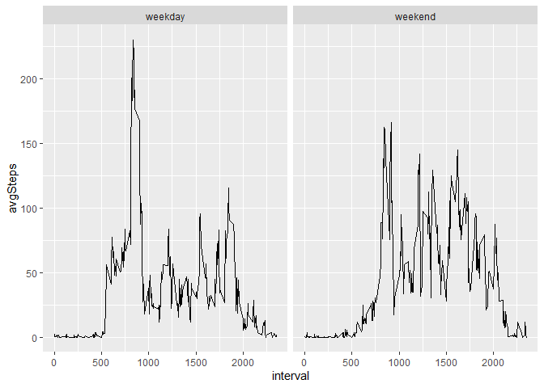

## Loading and preprocessing the data
Read in the data using read.csv()

```r
df <- read.csv(unzip("activity.zip","activity.csv"))
```

Load the dplyr package to help with data processing and ggplot for plotting

```r
library(dplyr)
```

```
## Warning: package 'dplyr' was built under R version 4.0.2
```

```
## 
## Attaching package: 'dplyr'
```

```
## The following objects are masked from 'package:stats':
## 
##     filter, lag
```

```
## The following objects are masked from 'package:base':
## 
##     intersect, setdiff, setequal, union
```

```r
library(ggplot2)
```

```
## Warning: package 'ggplot2' was built under R version 4.0.2
```


## What is mean total number of steps taken per day?
Calculate the total number of steps taken per day

```r
df %>% group_by(date) %>% 
  summarize(totalSteps = sum(steps, na.rm = T)) %>% 
  arrange(date) %>% 
  ungroup()
```

```
## `summarise()` ungrouping output (override with `.groups` argument)
```

```
## # A tibble: 61 x 2
##    date       totalSteps
##    <chr>           <int>
##  1 2012-10-01          0
##  2 2012-10-02        126
##  3 2012-10-03      11352
##  4 2012-10-04      12116
##  5 2012-10-05      13294
##  6 2012-10-06      15420
##  7 2012-10-07      11015
##  8 2012-10-08          0
##  9 2012-10-09      12811
## 10 2012-10-10       9900
## # ... with 51 more rows
```


Make a histogram of the total number of steps taken each day

```r
dfHist <- df %>% group_by(date) %>% 
  summarize(totalSteps = sum(steps, na.rm = T)) %>% 
  arrange(date) %>% 
  ungroup()
```

```
## `summarise()` ungrouping output (override with `.groups` argument)
```

```r
ggplot(data = dfHist, aes(x = totalSteps)) + geom_histogram()
```

```
## `stat_bin()` using `bins = 30`. Pick better value with `binwidth`.
```

<!-- -->


Calculate and report the mean and median of the total number of steps taken per day

```r
print(paste("The mean is", mean(dfHist$totalSteps, na.rm = T)))
```

```
## [1] "The mean is 9354.22950819672"
```

```r
print(paste("The median is", median(dfHist$totalSteps, na.rm = T)))
```

```
## [1] "The median is 10395"
```


## What is the average daily activity pattern?

Make a time series plot (i.e. type = "l") of the 5-minute interval (x-axis) and the average number of steps taken, averaged across all days (y-axis)

```r
dfTimeSeries <- df %>% group_by(interval) %>% 
  summarize(avgSteps = mean(steps, na.rm = T)) %>% 
  ungroup()
```

```
## `summarise()` ungrouping output (override with `.groups` argument)
```

```r
ggplot(data = dfTimeSeries, aes(x = interval, y = avgSteps)) + geom_line()
```

<!-- -->


Which 5-minute interval, on average across all the days in the dataset, contains the maximum number of steps?

```r
dfTimeSeries %>% filter(avgSteps == max(avgSteps))
```

```
## # A tibble: 1 x 2
##   interval avgSteps
##      <int>    <dbl>
## 1      835     206.
```


## Imputing missing values

Note that there are a number of days/intervals where there are missing values (coded as NA). The presence of missing days may introduce bias into some calculations or summaries of the data.

Calculate and report the total number of missing values in the dataset (i.e. the total number of rows with NAs)

```r
df %>% filter(is.na(steps)) %>% nrow()
```

```
## [1] 2304
```


Use the mean number of steps for each interval to fill in missing values. Create a new dataset that is equal to the original dataset but with the missing data filled in

```r
dfImputed <- df %>% left_join(dfTimeSeries,
                              by = c("interval")) %>% 
  mutate(steps = ifelse(is.na(steps), avgSteps, steps)) %>% 
  select(-avgSteps)
```


Make a histogram of the total number of steps taken each day and Calculate and report the mean and median total number of steps taken per day. Do these values differ from the estimates from the first part of the assignment? What is the impact of imputing missing data on the estimates of the total daily number of steps?

```r
dfHist2 <- dfImputed %>% group_by(date) %>% 
  summarize(totalSteps = sum(steps, na.rm = T)) %>% 
  arrange(date) %>% 
  ungroup()
```

```
## `summarise()` ungrouping output (override with `.groups` argument)
```

```r
ggplot(data = dfHist2, aes(x = totalSteps)) + geom_histogram()
```

```
## `stat_bin()` using `bins = 30`. Pick better value with `binwidth`.
```

<!-- -->


Report the mean and median total number of steps taken per day

```r
paste("The new mean is", mean(dfHist2$totalSteps))
```

```
## [1] "The new mean is 10766.1886792453"
```

```r
paste("The new median is", median(dfHist2$totalSteps))
```

```
## [1] "The new median is 10766.1886792453"
```

From using this method, the mean has now increased by over 1,000 steps per day, and the histogram shows a greater frequency of values in the middle


## Are there differences in activity patterns between weekdays and weekends?
Load lubridate package to help with handling dates, and convert dates to date objects

```r
library(lubridate)
```

```
## Warning: package 'lubridate' was built under R version 4.0.2
```

```
## 
## Attaching package: 'lubridate'
```

```
## The following objects are masked from 'package:base':
## 
##     date, intersect, setdiff, union
```

```r
dfImputed$date <- ymd(dfImputed$date)
```

Add variable indicating day of the week

```r
dfImputed$dayOfWeek <- weekdays(dfImputed$date)
```

Create a new factor variable in the dataset with two levels – “weekday” and “weekend” indicating whether a given date is a weekday or weekend day

```r
dfImputed <- dfImputed %>% 
  mutate(dayType = ifelse(dayOfWeek %in% c("Saturday", "Sunday"),
                          "weekend",
                          "weekday"))

dfImputed$dayType <- as.factor(dfImputed$dayType)
```


Make a panel plot containing a time series plot of the 5-minute interval (x-axis) and the average number of steps taken, averaged across all weekday days or weekend days (y-axis)

```r
dfTimeSeriesPanel <- dfImputed %>% group_by(interval, dayType) %>% 
  summarize(avgSteps = mean(steps)) %>% 
  ungroup()
```

```
## `summarise()` regrouping output by 'interval' (override with `.groups` argument)
```

```r
ggplot(data = dfTimeSeriesPanel, mapping = aes(x = interval, y = avgSteps)) +
  geom_line() +
  facet_grid(. ~ dayType)
```

<!-- -->

